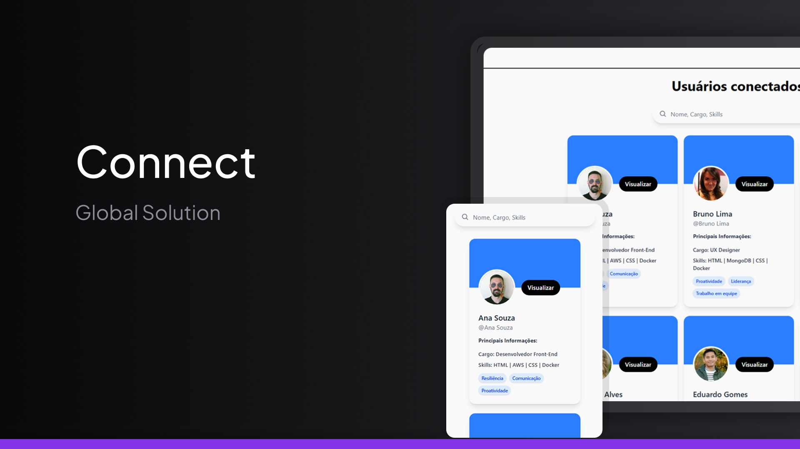

<h1 align="center">⚽ Passa a Bola</h1>

<p align="center">
  <a href="#-tecnologias">Tecnologias</a>&nbsp;&nbsp;&nbsp;|&nbsp;&nbsp;&nbsp;
  <a href="#-projeto">Projeto</a>&nbsp;&nbsp;&nbsp;|&nbsp;&nbsp;&nbsp;
  <a href="#-bibliotecas-e-ferramentas-extras">Bibliotecas</a>&nbsp;&nbsp;&nbsp;|&nbsp;&nbsp;&nbsp;
  <a href="#-deployment">Deployment</a>&nbsp;&nbsp;&nbsp;|&nbsp;&nbsp;&nbsp;
</p>

<br>

<p align="center">
  
</p>

---

## 🚀 Tecnologias

Este projeto foi desenvolvido com as seguintes tecnologias:


---

## 💻 Projeto

O **Connect** é uma plataforma semelhante ao LinkedIn, voltada à conexão entre profissionais de diferentes áreas, incentivando o desenvolvimento de competências, a troca de experiências entre os usuários.

A plataforma foi feita exatamente para simular uma rede profissional voltada ao futuro do trabalho, assim fazendo com que o usuário seja permitido exibir e explorar perfis de profissionais cadastrados, com informações pessoais, acadêmicas, profissionais e comportamentais.

---

## 📦 Bibliotecas e Ferramentas Extras

- [Shadcn/UI](https://ui.shadcn.com/) → componentes prontos e acessíveis.
- [Ant Design](https://ant.design/) → elementos visuais para interface.
- [React Icons](https://react-icons.github.io/react-icons/) → ícones personalizáveis e dinâmicos.
- [MockAPI](https://mockapi.io/projects/68d33e7dcc7017eec54654c2) → API que simula um banco de dados.

  ***

## 🌍 Deployment

Você pode acessar o projeto através da Vercel neste link:

👉 [**Connect - Acesse aqui**](connect-ten-delta.vercel.app)

---

## ⬇️ Como Executar o Projeto

1. Clone o repositório:  
   ```bash
   git clone https://github.com/PedroMarchese01/connect.git

2. Trocar para o repositório correto (caso não esteja):  
   ```bash
   cd connect

3. Fazer instalação do npm:  
   ```bash
   npm i

4. Adicionar o arquivo .env:  
   ```bash
   VITE_MOCKAPI_URL = "suaAPI"

5. Exemplificação de arquivo JSON aceitado no projeto:  
   ```bash
   {
    "id": 1,
    "nome": "Ana Souza",
    "foto": "https://randomuser.me/api/portraits/men/0.jpg",
    "cargo": "Desenvolvedor Front-End",
    "resumo": "Profissional com experiência em HTML e Dados.",
    "localizacao": "Salvador/BA",
    "area": "Desenvolvimento",
    "habilidadesTecnicas": [
      "HTML",
      "AWS",
      "CSS",
      "Docker"
    ],
    "softSkills": [
      "Resiliência",
      "Comunicação",
      "Proatividade"
    ],
    "experiencias": [
      {
        "empresa": "Empresa Inova",
        "cargo": "Analista de Sistemas",
        "inicio": "2018-01",
        "fim": "2022-04",
        "descricao": "Responsável pelo desenvolvimento e manutenção de sistemas corporativos."
      }
    ]
    } ´´´

6. Ver no localhost:  
   ```bash
   npm run dev
    

## 👨‍💻 Autores

- [Augusto Valerio](https://github.com/Augusto-Valerio) RM: 562185
- [Jonas Esteves](https://github.com/JonasEstevess) RM: 564143
- [Pedro Marchese](https://github.com/PedroMarchese01/connect) RM: 563336
